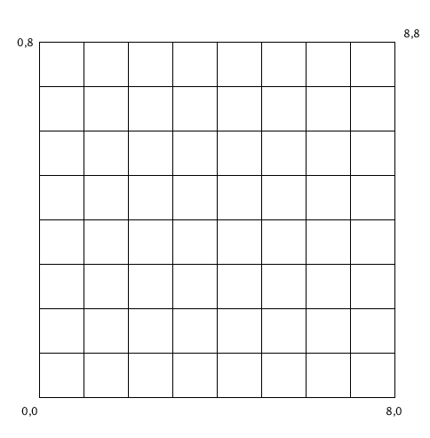
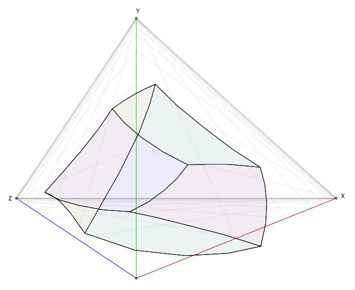

# Implementing three-point perspective

This might seem an odd article: every tutorial on the internet teaches you that three point perspective is just the art term for "regular 3D", where you set up a camera, tweak its distance, FOV, and zoom, and you're done. The vanishing points that you use when using pen and paper correspond to where the X, Y, and Z axes intersect your clipping plane, and that's all she wrote... Except we can write more, because we can push three point perspective to its limit, and get some very funky results.

The thing that makes it tricky is that in strict three point perspective, your vanishing points are _literally_ vanishing points: they don't represent intersections of axes that run to infinity and a clipping plane somewhere off in the distance relative to your camera, the vanishing points _are_ infinity. Which is a problem because that means we're not dealing with linear space, which means we can't use linear algebra to compute nice "3D world coordinates to 2D screen coordinates" using matrix operations. Which is a slight problem given that that's the fundamental approach that allows efficient 3D computer graphics on pretty much any modern hardware.

So let's look at what makes this unusual, and how we can implement it anyway.

## A note on why you'd want to do this

Realistically? You probably don't.

Before we continue, I want to make it very clear that you will almost **never** need the kind of "strict" three point perspective we're about to dive into. Even if it's relatively easy to implement, it's _even easier_ to just use any graphics package with a camera, and set its distance and FOV such that you get a distorted perspective similar to two or three point perspective.

However, it is a neat programming challenge, and no one's got an explainer page specifically about this topic anywhere on the internet as far as I can tell as I'm writing this text, so that's certainly good enough to work out some code and see what it does.

## Table of Contents

- [Working with perspective](#working-with-perspective)
- [Perspective-mapping our plane coordinates](#perspective-mapping-our-plane-coordinates)
- [Drawing a perspective point(#drawing-a-perspective-point)
- [Using exponential mapping](#using-exponential-mapping)
- [Using rational mapping instead](#using-rational-mapping-instead)
- [Implementing strict two point perspective](#implementing-strict-two-point-perspective)
- [Implementing strict three point perspective](#implementing-strict-three-point-perspective)
- [Placing content "behind us"](#placing-content-behind-us)
- [What happens if we had used exponential mapping?](#what-happens-if-we-had-used-exponential-mapping)
- [Concluding remarks](#concluding-remarks)


## Working with perspective


As three point perspective is a variation on two point perspective, let's first have a look at how two point perspective works, to get a feel for what we're dealing with:


We have two vanishing points, labeled Z and X here, and some arbitrary "zero" point where we simply say "this is (0,0,0)" (using thee coordinates, because right now there's an implied Y coordinate, but we'll make it explicit soon enough).

When you're drawing on a piece of paper you don't really mark the zero point, but computers need a bit more precision, so we need to explicitly say where it goes, making "two point perspective" actually a "three points" perspective as far as computers are concerned. However, we also need to say what the elevation is from our "zero" point to the horizon (the line between Z and X) because even though you you won't be working with "coordinates" when using pencil and paper, computers very much need to know at least one fixed height that it can use to derive all other heights... making "two point perspective" actually "three points and a number" perspective.

So, let's say that the height from the ground to the horizon, at our zero point, is simply "one", then this will give us the following perspective:


And this gives us (but more importantly, computers) all the information necessary to correctly map arbitrary coordinates to the screen, so we can draw pretty graphics using two point perspective. We just need to know how to implement the mapping.

## Perspective-mapping our plane coordinates

There's one thing that you'll almost certainly have noticed already, but might not have considered yet as needing some care in dealing with: the previous "graphs" don't use plain, standard grids. Instead, we see the grid getting finer and finer, the farther away we get from our zero point.

Instead of a "normal" grid with a "normal" coordinate system like this...



...we have something that's more like the following "grid", with an infinite number of values compressed to a fixed length interval:


Although that's not quite the kind of thing we're dealing with in two and three point perspective, because if we look at the perspective images from the start of this section, we're working with a triangle rather than a rectangle, so things get even more interesting: we need to further compress things to get something that looks like this:


While it might look like this triangle is the same as the above rectangular grid, just with the upper right corner moved inward so it forms a diagonal with the other two points, that's not actually the case. If you look at the upper left and lower right points, you'll see that our grid lines all converge. Calling those corners Z and X (to match our two point perspective labels), we see that all values x=..., z=∞ lie on the same point (namely, our point Z), which would not be the case if all we did was move our corner point in. In that case, all our originally parallel lines would still "end" at spread-out intervals along the diagonal.

What has happened here, instead, is that the _entire diagonal line_ represents (different versions of) the coordinate (∞,∞), whereas the two _points_ Z and X now represent entire "lines" of infinities. That's kind of crazy, this perspective thing seems so simple on paper!

Now, there are a lot of ways to achieve a mapping that has these properties, and not all of them are actually all that great, so let's look at a naïve (and very wrong) way to achieve this mapping, as well as more informed (and much more useful, but still problematic at times) way to do the same. 

## Drawing a perspective point

In order to figure out what kind of mapping function we can use, let's look at how we draw points on paper. Say we want to draw the point x=0.5 and z=1, we would mark those points on their respective axes, then draw a line from Z to x=0.5, and from X to z=1, and where those two lines intersect is our point (0.5, 1), so let's put a picture to those words:


We see that as long as we know where to find x values along the X axis, and where to find z values along the Z axis, we can draw any point on the XZ plane. We could describe that in terms of pixels, but that's pretty tedious: instead we can describe where points along the axes are using [linear interpolation](https://en.wikipedia.org/wiki/Linear_interpolation), so that the exercise of mapping coordinates becomes an exercise in "mapping the distance ratio" instead. For example, in our original, plain grid, an x value of 1 lies 1/8th away from 0 and 7/8th away from 8, and a value of 4 lies 1/2 away from 0 and 1/2 away from 8. 

The standard linear interpolation function takes a minimum and maximum value, and some ratio value between zero and one:
$$
lerp(min, max, ratio) = min \cdot (1 - ratio) + max \cdot ratio
$$
This has the property that if _ratio_ is 0, the result of _lerp_ is the minimum value, and when _ratio_ is 1, the result of _lerp_ is the maximum value. This means that to achieve a useful mapping, we need to find a function that turns our "value along an axes" (which can be anything from negative infinity to positive infinity) into a value that, at the very least, maps to 0 when the input is 0 and maps to 1 when the input is infinity. 

So, let's naïvely do that!


## Using exponential mapping

If we need a function that is 1 when the input is 0 and 0 when the input is infinity, then the intuitive (but as it will turn out, not very useful) choice would be to find out what mathematical function gives us something like the following mapping:


We don't actually care about the precise values, as long as:

1. _f(0)_ gives us 0,
2. _f(s)_ gets closer and closer to 1 as _s_ becomes larger and larger in the positive direction,
3. _f(s)_ heads off towards negative infinity as _s_ becomes larger and larger in the negative direction

And as it so happens, there is a function that does that, although it's standard form does the exact opposite: the inverse exponential function. Which looks like this:
$$
f(s) = \frac{1}{a^s}
$$
Although if we plot that, we see the following:


Which seems completely wrong, but is actually almost exactly what we want: 

1. _f(0)_ gives us 1,
2. _f(s)_ gets closer and closer to 0 as _s_ becomes larger and larger in the positive direction,
3. _f(s)_ heads off towards infinity as _s_ becomes larger and larger in the negative direction

So to get to our original criteria, all we need to do is flip this function by subtracting it from one:
$$
f(s) = 1 - \frac{1}{a^s}
$$
We can very easily implement this mapping...

```java
double map(s) {
    return 1.0 - 1.0 / pow(a, s);
}
```

...leaving us with the choice of which value to use for _a_: it needs to be a value larger than 1, and the larger we make _a_, the bigger the difference in initial grid spacing and subsequent spacings will be, and the bigger the perspective distortion will feel.

For instance, compare _a_=1.2 on the left, with _a_=2 on the right. Even at a low value like 2 we already get something that feels _pretty_ distorted:

 

So as long as we use relatively low values for _a_ we should get something that looks good. However, we also want to make sure that straight lines stay straight. We know that, by definition, axis-aligned lines stay straight, but let's plot some more lines to see whether our mapping holds up. First let's try some parallel diagonals:


That looks to be holding up pretty well! But just to make doubly sure, let's also plot some other types of straight lines, like the lines x=z/4, x=z/2, z=x/2, and z=x/4. Those should still end up looking straight.


And that's where things break down: while our exponential mapping might have seemed well behaved, it turns out has the disastrous effect of turning most lines into curves.  So this was a decent first guess, but let's find a better mapping function, because using this one will cause [super weird things](#what-happens-if-we-had-used-exponential-mapping) to happen if we went ahead with it.


## Using rational mapping instead

If we look at our criteria again, that third criterium isn't actually strictly true. At some point negative coordinates are far away enough that they end up "behind" us, as viewer, and what happens where we can't see things doesn't strictly speaking actually matter to us. By relaxing that criterium a bit, we can find a different kind of function that won't run into the whole "straight lines turn into curves" problem we saw earlier.

So, let's update the criteria list:

1. _f(0)_ should give us 0,
2. _f(s)_ should get closer and closer to 1 as _s_ becomes larger and larger in the positive direction,
3. _f(s)_ heads off towards negative infinity **at some negative value _s_ ** and we don't care what happens "past" that.

Now a much better candidate would be the [multiplicative inverse](https://en.wikipedia.org/wiki/Multiplicative_inverse) function (with the same "one minus ..." trick to make sure it's a useful linear interpolation ratio):


$$
f(s) = 1 - \frac{1}{a \cdot s}
$$
If we plot this, we get plots that look like this:


And that's almost perfect, but it has one glaring problem: we want this to be the value 0 at s=0, not negative infinity, so we can offset our fraction a tiny bit to fix that:
$$
f(s) = 1 - \frac{1}{1 + a \cdot s}
$$
now when _s_=0, _f(s)_ is 1 minus 1/1, which is the zero we want. Conversely, when _s_ "is" infinity, _f(s)_ is 1 minus 1/(1+infinity), which is 1 minus zero, which is 1. So we're in good shape. If we plot this update function, we see:


And this is where that factor _a_ comes into play: with _a_=1 we get a graph with an asymptote at _s_=-1, meaning that any coordinate equal to or less than -1 will behave drastically different from coordinates greater than -1. We can push that value back by using smaller values for _a_: if we want to have well-behaved coordinates up to some negative value `-k` then we can set `a` to `1/k`. For instance, if we want everything above -8 to be well behaved, we can set _a_=1/8 and get the following behavior, with an asymptote at -8:


So, what kind of grid do we get with this mapping function? Using `a=0.25`, we get the following "triangle grid":


Which looks pretty good, but let's check those straight lines again:

 

On the left we see what happens with diagonal straights: rather than all running parallel towards the horizon like in the exponential mapping case, they now each map to their own point on the diagonal. That's different, but the lines are still straight, so it's fine. Similarly, trying our straight lines x=z/4, x=z/2, z=x/2, and z=x/4 again still shows straight lines getting preserved.

So with that rather lengthy investigation on mapping functions covered, let's get to implementing some 3D perspective already!


## Implementing strict two point perspective

Let's finally implement two point perspective, given our three points Z, X, and our zero point, which we'll call C. First, let's implement that mapping function:

```java
final double PERSPECTIVE_FACTOR = 0.25;

double distanceToRatio(double s) {
  return 1.0 - 1.0 / (1.0 + PERSPECTIVE_FACTOR * s);
}
```

We can now define a function that turns a 3D world coordinate (with y=0, for now) into a 2D screen coordinate, by running through the procedure we looked at earlier: find the coordinate's distance along the X axis,  do the same for the Z axis, and our 2D projection will be the intersection of the line from Z to the point on the X axis, and from X to the point on the Z axis. Looking at the (x=0.5, z=1) case again:


So let's express that procedure in code:

```java
Vec2 get(double x, double z) {
  // first, a shortcut for when no line intersections are necessary:
  if (x==0 && z==0) return C;

  // and then the code for when we do need line intersections:
  Vec2 px = lerp(C, X, distanceToRatio(x));
  Vec2 pz = lerp(C, Z, distanceToRatio(z));
  return lli(X, pz, Z, px);
} 
```

In this code, **lerp** is the [linear interpolation function](https://en.wikipedia.org/wiki/Linear_interpolation) (for vectors rather than scalars in this case), and **lli** computes a "**l**ine/**l**ine **i**ntersection", with the following implementation:

```java
Vec2 lli(Vec2 l1p1, Vec2 l1p2, Vec2 l2p1, Vec2 l2p2) {
  return lli(l1p1.x, l1p1.y, l1p2.x, l1p2.y, l2p1.x, l2p1.y, l2p2.x, l2p2.y);
}

Vec2 lli(double x1, double y1, double x2, double y2, double x3, double y3, double x4, double y4) {
  double  d = (x1 - x2) * (y3 - y4) - (y1 - y2) * (x3 - x4);
  if (d == 0) return null;

  double c12 = (x1 * y2 - y1 * x2);
  double c34 = (x3 * y4 - y3 * x4);
  double nx = c12 * (x3 - x4) - c34 * (x1 - x2);
  double ny = c12 * (y3 - y4) - c34 * (y1 - y2);
  return new Vec2(nx/d, ny/d);
}
```

With the above code in place, we can now draw things on the y=0 plane:

```java
void drawSomeGeometry() {
    fill(0, 200, 0);

    beginShape();
    vertex(0,0);
    vertex(3,0);
    vertex(3,1);
    vertex(1,1);
    vertex(1,3);
    vertex(0,3);
    endShape(CLOSE);
    
    beginShape();
    vertex(2,2);
    vertex(2,3);
    vertex(3,3);
    vertex(3,2);
    endShape(CLOSE);   
}

void vertex(double x, double z) {
    addShapeVertex(get(x,z));
}
```

Giving us the following graphic:


Of course, the whole point of two and three point perspective, is to draw _perspectives_ rather than flat projections, so let's extend our `get()` function so that it takes elevation into account. This requires a few values specified/computed up front as part of specifying our vanishing points, so we can use them in our elevation-updated `get()` function:

```java
Vec2 HC = lli(C, C.plus(0,10), Z, X); // C projected onto the horizon Z--X.
double dyC = C.y - HC.y;              // The y-distance in screen pixels between C and its projection.
double yScale = 5.0;                  // This determines what height is drawn as "level" to the viewer.
double yFactor = dyC / yScale;        // By how much we need to scale world.y to get screen.y?
```

We can set all of these at the same time we set the X, Z, and C screen coordinates, meaning we'll have all of this already available by the time we start drawing things. 

We then update our `get()` function to take elevation into account:

```java
Vec2 get(double x, double y, double z) {
  // the same shortcut as before, but now in three dimensions:
  if (x==0 && y==0 && z==0) return C;

  // And then the same start as before, which covers y==0:
  Vec2 px = lerp(C, X, stepToDistanceRatio(x));
  Vec2 pz = lerp(C, Z, stepToDistanceRatio(z));
  Vec2 ground = lli(X, pz, Z, px);
  if (y==0) return ground;
  
  // If we have an elevation, it will be a vertical offset from the ground,
  // with the elevation scaled based on how close our ground plane point is
  // to the horizon (X--Z), as well as how close it is our vanishing points.

  // So: are we to the left, or to the right, of our center line?
  boolean inZ = (ground.x < C.x);
    
  // Determine our first height scaling factor, based on how close
  // we are to our vanishing points (Z if "in Z", X otherwise).
  double rx = inZ ? (ground.x - Z.x) / (C.x - Z.x) : (X.x - ground.x) / (X.x - C.x);
  
  // Then, determine the second height scaling factor based on how
  // close our coordinate on the ground plane is to the horizon.
  Vec2 onAxis = lli(inZ ? Z : X, C, ground, ground.plus(0, 10));
  double ry = (ground.y - HC.y) / (onAxis.y - HC.y);
    
  // Our final screen-height is the world height, times the yFactor
  // (i.e. the elevation this coordinate would have if the x/z
  // coordinates were zero), times our two scaling factors.
  return ground.minus(0, rx * ry * y * yFactor);
} 
```

And now we can do some proper two point perspective drawing:

```java
void drawSomeGeometry() {
  // let's define a 1x7x2 box
  Vec2[] p = {
    get(0, 0, 0), 
    get(1, 0, 0), 
    get(1, 0, 2), 
    get(0, 0, 2), 
    get(0, 7, 0), 
    get(1, 7, 0), 
    get(1, 7, 2), 
    get(0, 7, 2), 
  };

  // and then let's draw its wireframe
  for (int i=0; i<4; i++) {
    line(p[i],     p[(i+1)%4]);
    line(p[4 + i], p[4 + (i+1)%4]);
    line(p[i],     p[4 + i]);
  }
}
```

This gives us the following 3D perspective "drawing":


Looking pretty good! But: that only covers two point perspective. Let's up the point count, by making the elevation a third "fixed distance to infinity" axis as well. If you made it this far, things are about to look a lot more pointy!

## Implementing strict three point perspective

Making our elevation a mapped axis gives us this delightful little world space, with every possible coordinate somewhere in the diamond bounded by Z, C, X, and Y:


We now have three vanishing points that can never be reached (except by pixel rounding) and all verticals now converges at Y. So, let's write a `get3()` function for computing screen coordinates using this three point perspective. First off, let's sketch the procedure we'll need to implement for constructing 3D points in this three point perspective space:

> ADD LABELS TO THE COORDINATES


We're basically doing the same thing we did for the two point perspective, but three times: first we find the point XY based on its X and Y axis coordinates, then we do the same for point YZ based on its Y and Z axis coordinates, and then lastly we find the intersection between the line from XY to Z, and the line from X to YZ. That intersection is the projection of our 3D point. In code:

```java
Vec2 get3(double x, double y, double z) {
  if (x==0 && y==0 && z==0) return C;
    
  Vec2 px = lerp(C, X, stepToDistanceRatio(x));
  Vec2 pz = lerp(C, Z, stepToDistanceRatio(z));

  if (y==0) return lli(X, pz, Z, px);

  Vec2 py = lerp(C, Y, stepToDistanceRatio(y));
  Vec2 YZ = lli(Y, pz, Z, py);
  Vec2 XY = lli(Y, px, X, py);
  return lli(XY, Z, X, YZ);
}
```

So, what does this look like for the 1x7x2 beam we drew earlier using two point perspective?


That's not great. It's correct, but it's also weirdly stretched. As it turns out, the reason for this is that we're using the same scaling factor for all three dimensions, whereas we really want to use a separate scaling for our Y axis. So, let's make that happen:

```java
final double PERSPECTIVE_FACTOR = 0.25;
final double PERSPECTIVE_FACTOR_Y = 0.125;

double distanceToRatio(double s) {
    return distanceToRatio(s, false);
}

double distanceToRatio(double s, boolean forY) {
  return 1.0 - 1.0 / (1.0 + (forY ? PERSPECTIVE_FACTOR_Y : PERSPECTIVE_FACTOR) * s);
}

Vec2 get3(double x, double y, double z) {
  if (x==0 && y==0 && z==0) return C;
    
  Vec2 px = lerp(C, X, stepToDistanceRatio(x));
  Vec2 pz = lerp(C, Z, stepToDistanceRatio(z));

  if (y==0) return lli(X, pz, Z, px);

  Vec2 py = lerp(C, Y, stepToDistanceRatio(y, true)); // A small, but important, change.
  Vec2 YZ = lli(Y, pz, Z, py);
  Vec2 XY = lli(Y, px, X, py);
  return lli(XY, Z, X, YZ);
}
```

This makes things look a little better, giving us a way to control exactly how much stretching we want, if this isn't quite to our liking yet:


## Placing content "behind us" 

So what actually happens when we try to draw things that cross that mapping asymptote? Let's shift our cube down a little until some of the coordinates are still in the nice part of our mapping function, with others in the differently-behaved part:


"Not looking too bad..."


"Hm, running out of the screen a bit, but still looks as expected..."


"...uh... what is happening..?"


"Oh no, make it stop!"

The problem we're running into as we move points is that at some point they "cross the asymptote" and the way they get mapped completely changes compared to any points that are still on the "regular" side of the asymptote. The solution to this is something called [culling](https://en.wikipedia.org/wiki/Back-face_culling), where we remove any geometry that isn't visible to us as viewer, which can lead to interesting artifacts if performed blindly when dealing with faces of which one or more vertices are still visible. In those cases, for a proper fix, we need to rewrite the geometry of what's getting drawn, introducing new vertices that allow us to subdivide the faces into "still good" and "not needed" parts, and then ignoring the not needed parts.

That's currently beyond the scope of this write-up, so the easiest solution tends to be "don't draw past your asymptote", and if you have coordinates that would end up making that happen anyway, uniformly move your entire scene. We can achieve this with a fairly dumb trick: passing an optional offset to our `get3` function:

```java
// get3 with a global offset
Vec2 get3(double x, double y, double z, double ox, double oy, double oz) {
  return get3(x + ox, y + oy, z + oz);
}
```

And that's it, we now know how to implement two point perspective, three point perspective, and we know the pitfalls that come with trying to implement it. But before I close this out, let's look at one more thing...

## ...what happens if we _had_ used exponential mapping?

Let's find out! First, let's update our mapping to use exponential values:

```java
final double EXPONENTIAL_BASE = 2;
final double EXPONENTIAL_BASE_Y = 1.2;

double distanceToRatio(double s, boolean forY) {
    return distanceToRatio(s, false);
}

double distanceToRatio(double s, boolean forY) {
  return 1.0 - 1.0 / pow(forY ? EXPONENTIAL_BASE_Y : EXPONENTIAL_BASE, s);
}
```

And then let's make sure to also define a new function that draws "lines" by generating a number of points on what should be a line, mapping each of those from 3D to 2D using exponential mapping, and then joining them up with line segments:

```java
void curve(Vec3 p1, Vec3 p2) {
  double steps = min(10, (int) p2.minus(p1).mag());
  beginShape();
  for(double i=0; i<=1; i+=1.0/steps) {
    vertex(get(lerp(p1, p2, i)));
  }
  endShape();
}
```

And let's test that function to draw some "straight lines" onto the XY plane:

```java
void drawCurveIllustration() {
  curve(new Vec3(0,0,0), new Vec3(20, 5,0)); // y = 0.25x
  curve(new Vec3(0,0,0), new Vec3(20,10,0)); // y = 0.5x
  curve(new Vec3(0,0,0), new Vec3(20,15,0)); // y = 0.75x
  curve(new Vec3(0,0,0), new Vec3(20,20,0)); // y = x
  curve(new Vec3(0,0,0), new Vec3(15,20,0)); // y = 1.33x
  curve(new Vec3(0,0,0), new Vec3(10,20,0)); // y = 2x
  curve(new Vec3(0,0,0), new Vec3( 5,20,0)); // y = 4x
}
```

Which gives us the following "curved straight lines":


Beauty: this is going to go so wrong, so fast... let's see what happens if we draw a cube!


As we might have guess, nothing unusual there, all the lines are axis-aligned so we won't see the effect of exponential distortion kicking in. However: if we rotate that same cube even just little bit, things get very fun, very fast indeed!



That's the stuff.

And remember: in world coordinates, none of these edges are actually curved, they're all straight lines with perfectly straight angles between them. It's just the exponential mapping completely ignoring that. It's hilarious, and animating it is like watching a drunk computer try to do maths and getting it horribly wrong. 

## Concluding remarks

Implementing both two point perspective projection as well as three point perspective projection using whatever programming language you have lying around isn't really all that much work, and the procedure for it is effectively dictated by the same procedure we use when drawing perspective by hand. However, the freedom we have when implementing perspective drawing using a computer means we need to take care to make sure that the way we transform 3D coordinates into base plane coordinates preserves straight lines. As mentioned all the way at the start, I mostly wrote this because after searching the web for quite a while I couldn't find a single write-up that explained how to implement this yourself, so now there's at least one.

However, there's no doubt still incompletions, or oddly phrased parts, so if you have opinions that you think can lead to improvements to this write-up, and you want to discuss them, head on over to [the issue tracker](https://github.com/Pomax/three-point-perspective/issues) and post a message. And if you don't want to discuss them, that's fine too, you can just [tweet at me]() but be aware that nothing might change in the article itself.

Thanks for reading, and have fun coding!

— [Pomax](https://twitter.com/TheRealPomax)
