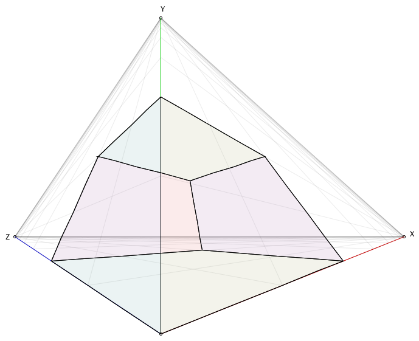

# Implementing strict three-point perspective

This might seem an odd article: every tutorial on the internet teaches you that three point perspective is just the art term for "regular 3D", where you set up a camera, tweak its distance, FOV, and zoom, and you're done. The vanishing points that you use when using pen and paper correspond to where the X, Y, and Z axes intersect your clipping plane, and that's all she wrote... Except that's not "true" three point perspective. That's the easy-for-computer-graphics version of three point perspective: the strict version is quite a bit trickier.

The thing that makes it tricky is that in strict three point perspective, your vanishing points are _literally_ vanishing points: they don't represent intersections of axes that run to infinity and a clipping plane somewhere off in the distance relative to your camera, the vanishing points _are_ infinity. Which is a problem because that means we're not dealing with linear space, which means we can't use linear algebra to compute nice "3D world coordinates to 2D screen coordinates" using matrix operations. Which is a slight problem given that that's the fundamental approach that allows efficient 3D computer graphics on pretty much any modern hardware.

So let's look at what makes this so crazy, and how we can implement it anyway.

## A note on why you'd want to do this

Realistically? You don't.

Before we continue, I want to make it very clear that you will almost **never** need strict three point perspective: it is not "useful" so much as it is a rather strange 3D aesthetic. But it _is_ a programming challenge, and no one's got a page up about this on the internet as I write this text, so that's certainly challenge enough to work out what the heck is up with this crazy projection and explain the code we need to achieve it.

## Working in exponential space


Let's have a look at the two point perspective, to get a feel for what we're dealing with:


We have two vanishing points, labeled Z and X here, and some arbitrary "zero" point where we simply say "this is (0,0,0)" (using thee coordinates, because right now there's an implied Y coordinate, but we'll make it explicit soon enough). We also need some point to act as our "zero": when you're drawing on a piece of paper you can just decide where that is, but when working with computers we need to be explicit about where fixed points are. This actually makes "two point perspective" a three point perspective for computers, because you need to specify three points, but that's neither here nor there. We then also need to say what the elevation is from our zero to the horizon, because (again) while you're drawing you can just wing it, but computers need to know what that value is so that arbitrary coordinates can get mapped to the screen correctly. Make "two point perspective" actually "three points and a number" perspective. Let's say that the height at the horizon for our perspective is simply one, then this will give us that following perspective:


And with that we have everything we need to construct pretty graphics in two point perspective. Except there's one thing that you'll almost certainly have noticed already, but might not have considered: the above "graph" isn't a normal graph. We see the grid getting finer and finer, the closer we get to X, Z, as well as the horizon. Rather than a standard grid, more precisely know as a [Cartesian](https://en.wikipedia.org/wiki/Cartesian_coordinate_system), and specifically [Euclidean](https://en.wikipedia.org/wiki/Euclidean_space), coordinate system like this:


We have something that's more like this:


That is, rather than an infinite grid that we could never fit on any kind of finite size piece of paper, we have a bounded grid, where the distance between a [world coordinate](https://www.cs.uic.edu/~jbell/CourseNotes/ComputerGraphics/Coordinates.html) at zero and at infinity is an _fixed distance_ in terms of [screen coordinates](https://www.cs.uic.edu/~jbell/CourseNotes/ComputerGraphics/Coordinates.html). As long as we understand the difference between world and screen coordinates: the screen coordinates are like a camera, it's what we "see" given the projection we've told the camera to use, whereas the world coordinates are "the actual things themselves". Even though our projection can turn an infinity into a fixed point, as far as the world coordinate system is concerned, there's still no way for something to ever actually _be_ at infinity, let alone be _beyond_ infinity, even though our projection lets us put the mouse cursor exactly on, or even beyond, where infinity gets projected onto the screen.

This is an example of a Cartesian, but **non-Euclidean**, coordinate system. That is: there _is_ a one-to-one mapping between the regular grid and this one, but we _can't_ use [linear algebra](https://en.wikipedia.org/wiki/Linear_algebra) to express that mapping.

However, the above illustration only exists to get us comfortable with the idea of mapping infinity, by looking at an illustration of mapping an infinite range to a fixed size. The actual projection we're dealing in two point perspective is more complex than the one shown above still:


Not only is our grid not linear, it is not even Cartesian: while it might look like this triangle is the same as the above rectangular grid, but with the upper right corner moved inward so it forms a diagonal with the other two points, that's not actually the case. If you look at the upper left and lower right points, you'll see that our grid lines all converge. Using the labeling **Z** and **X** for the two points, you can see that all values x=..., z=∞ lie on the same point, **Z**, which would not be the case if all we did was move our corner point in. If that had been the case, all those values would lie somewhere between **Z** and the midpoint of the diagonal (with a similar case for **X**) and our grid lines would not converge to single points. Instead, the _entire diagonal line_ represents the "point" (∞,∞). Even though in reality nothing can ever get there, once a point reaches infinity in either X, Z, or both dimensions, it would become spread out over the entire diagonal, whereas the lines (n,∞) and (∞,n) become the _points_ **Z** and **X**.

As a non-cartesian coordinate system, two point perspective is an example of a kind of projection that we're going to have to evaluate the old fashioned way: mathematically _cannot achieve_ by using a transformation matrix to turn world coordinates into screen coordinates. The thing that all modern 3D graphics are based on, all the way from software down to the maths that gets performed by the physical chips on your GPU.

So, that's what we're working with, we best get to figuring what code we need to write to work with it.


## Implementing strict two point perspective

So, let's implement two point perspective, given our four points **Z**, **X**, and our zero point, which we'll call **C**.

First, let's define our transform to turn a linear value into an exponential ratio. We want something that, given value of x=1 for example, yields the value "0.5" signifying that x=1 can be found midway on the X axis, x=2 yielding "0.75" (i.e. three quarters the distance from (0,0,0) along the X axis), and so forth.

You may have spotted the pattern, where we're just moving by halving the remaining interval for each whole step **s** we're taking, so that's just exponential decay:


When s=0, this gives us f(s)=1, and if s=∞ (ignoring that practically speaking this is impossible of course), we get f(s)=0. That's somewhat the opposite of what we actually want, namely have f(0) be 0 and f(∞) be 1, so we can force that:


Now s=0 gives us f(s)=0, and s=∞ gives us f(s)=1. Perfect. And of course implementing this is essentially trivial:

```java
double distanceToRatio(double s) {
  return 1.0 - 1.0 / pow(2.0, s);
}
```

We can now define a function that turns a 3D world coordinate (with y=0 for now) into a 2D screen coordinate, by doing what you'd do on paper as well: find the coordinate's distance along the X axis,  do the same for the Z axis, and then our coordinate can be drawn as the intersection of the line from Z to the point on the X axis, and from X to the point on the Z axis. For example, drawing x=0.5, z=1 gives:


With the coordinate mapping function looking like:

```java
Vec2 get(double x, double z) {
  if (x==0 && z==0) return C;
  Vec2 px = lerp(C, X, distanceToRatio(x));
  Vec2 pz = lerp(C, Z, distanceToRatio(z));
  return lli(X, pz, Z, px);
} 
```

In this code, **lerp** is the [linear interpolation function](https://en.wikipedia.org/wiki/Linear_interpolation) (for vectors rather than scalars in this case), and **lli** computes the intersection point of two lines:

```java
Vec2 lli(Vec2 l1p1, Vec2 l1p2, Vec2 l2p1, Vec2 l2p2) {
  return lli(l1p1.x, l1p1.y, l1p2.x, l1p2.y, l2p1.x, l2p1.y, l2p2.x, l2p2.y);
}

Vec2 lli(double x1, double y1, double x2, double y2, double x3, double y3, double x4, double y4) {
  double  d = (x1 - x2) * (y3 - y4) - (y1 - y2) * (x3 - x4);
  if (d == 0) return null;

  double f12 = (x1 * y2 - y1 * x2);
  double f34 = (x3 * y4 - y3 * x4);
  double nx = f12 * (x3 - x4) - f34 * (x1 - x2);
  double ny = f12 * (y3 - y4) - f34 * (y1 - y2);
  return new Vec2(nx/d, ny/d);
}
```

With the above code in place, we can now draw things on the y=0 plane:

```java
void drawSomeGeometry() {
    beginShape();
    vertex(0,0);
    vertex(3,0);
    vertex(3,1);
    vertex(1,1);
    vertex(1,3);
    vertex(o,3);
    endShape(CLOSE);
    
    beginShape();
    vertex(2,2);
    vertex(2,3);
    vertex(3,3);
    vertex(3,2);
    endShape(CLOSE);   
}

void vertex(double x, double z) {
    addShapeVertex(get(x,z));
}
```

This now gives us the following graphic:


Of course, the whole point of two and three point perspective, is to draw _perspectives_ rather than flat projections, so so let's extend our `get()` function so that it takes elevation into account. This requires a few values specified/computed up front as part of specifying our vanishing points, so we can use them in our elevation-updated `get()` function:

```java
Vec2 HC = lli(C, C.plus(0,10), Z, X); // C projected onto the horizon Z--X
double dyC = C.y - HC.y; // the y-distance in screen pixels between C and its projection
double yScale = 5.0; // this determines what height is drawn as "level" to the viewer
double yFactor = dyC / yScale; // by how much we need to scale world-y to get screen-y
```

We can set all of these at the same time we set the **X**, **Z**, and **C** screen coordinates, meaning we'll have all of this already available by the time we start drawing things. 

We then update our `get()` function to take elevation into account:

```java
Vec2 get(double x, double y, double z) {
  if (x==0 && y==0 && z==0) return C;

  // we start out the same as before, which covers y==0
  Vec2 px = lerp(C, X, stepToDistanceRatio(x));
  Vec2 pz = lerp(C, Z, stepToDistanceRatio(z));
  Vec2 ground = lli(X, pz, Z, px);
  if (y==0) return ground;
  
  // if it's not, our elevation is a vertical offset from the ground plane,
  // with the elevation scaled based on how close our ground plane point is
  // to the horizon (X--Z), as well as how close it is our vanishing points.

  // are we to the left, or to the right, of our center line?
  boolean inZ = (ground.x < C.x);
    
  // determine our first height scaling factor, based on how
  // close we are to Z, or X, depending on which side of the
  // center line our ground plane coordinate is located.
  double rx = inZ ? (ground.x - Z.x) / (C.x - Z.x) : (X.x - ground.x) / (X.x - C.x);
  
  // then, determine the second height scaling factor based on
  // how close our ground plane coordinate is to the horizon.
  Vec2 onAxis = lli(inZ ? Z : X, C, ground, ground.plus(0, 10));
  double ry = (ground.y - HC.y) / (onAxis.y - HC.y);
    
  // our final screen-height is the world height, times the
  // yFactor (which is the elevation if the x/z coordinates
  // were zero), times the two scaling factors.
  return ground.minus(0, rx * ry * y * yFactor);
} 
```

And now we can do some proper two point perspective drawing:

```java
void drawSomeGeometry() {
    Vec2[] p = {
      get(0,0,0),
      get(1,0,0),
      get(1,0,2),
      get(0,0,2),
      get(0,7,2),
      get(1,7,2),
      get(1,7,0),
      get(0,7,0),      
    }
    // ...and then some lines between these corner points...
}
```

Giving us the following 3D perspective "drawing":


Looking pretty good! But that's only two point perspective. Three point perspective ups the non-Euclidean-ness by also making the elevation a "fixed distance to infinity" axis. If you made it this far: things are about to get _really_ weird!

## Three point perspective

Making our elevation an exponential dimension gives us this delightful little world space:


We now have three vanishing points that can never be reached (except by pixel rounding) and where in two point perspective at least we have parallel lines for our verticals, that's gone: all verticals now converges at Y. So, let's write a `get3()` function for computing screen coordinates using three point perspective.

First off, let's sketch out how to get our 3D point in this kind of space:


We're basically doing the same thing we did for the two point perspective, twice: we construct the point XY from its X and Y axis coordinate, and then we do the same for point YZ, and then we find the intersection between the line XY--Z and line X--YZ. And that's it, we're done. In code:

```java
Vec2 get3(double x, double y, double z) {
  if (x==0 && y==0 && z==0) return C;
    
  Vec2 px = lerp(C, X, stepToDistanceRatio(x));
  Vec2 pz = lerp(C, Z, stepToDistanceRatio(z));

  if (y==0) return lli(X, pz, Z, px);

  Vec2 py = lerp(C, Y, stepToDistanceRatio(y));
  Vec2 YZ = lli(Y, pz, Z, py);
  Vec2 XY = lli(Y, px, X, py);
  return lli(XY, Z, X, YZ);
}
```

So, what does this look like for the 1x7x2 beam we drew earlier, using two point perspective?


That's not great... it's correct, but it's also pretty horrible... The reason for this is that by using exponential decay with base 2 we approach Y _really_ quickly. However, we can control this by changing the value we use as exponential base. 

```java
double yBase = 1.25;

double stepToDistanceRatio(double step) {
  return stepToDistanceRatio(2.0, step);
}

double stepToDistanceRatio(double base, double step) {
  return 1.0 - 1.0 / pow(base, step);
}

Vec2 get3(double x, double y, double z) {
  if (x==0 && y==0 && z==0) return C;

  Vec2 px = lerp(C, X, stepToDistanceRatio(x));
  Vec2 pz = lerp(C, Z, stepToDistanceRatio(z));
  if (y==0) return lli(X, pz, Z, px);
  
  Vec2 py = lerp(C, Y, stepToDistanceRatio(yBase, y));
  Vec2 YZ = lli(Y, pz, Z, py);
  Vec2 XY = lli(Y, px, X, py);
  return lli(XY, Z, X, YZ);
}
```

This makes things look a little better:


But that's it, we've successfully implemented strict three point perspective!

...

Hahaha, no we haven't, we've actually been looking at an incredibly lucky edge case so far, where we've effectively been getting lucky with our choice of coordinates, giving us nice, clean, straight lines to work with. That's not actually how exponential space works for the vast majority of lines between points, so let's discover what shapes _actually_ look like most of the time.

## There are (almost) no straight lines in exponential space

So far we've been looking at drawing straight, axis-aligned lines, and that might trick you into thinking that exponential space is pretty similar to Euclidean space, which would be a huge mistake. There are in fact only two kinds of lines that look straight in strict two or three point perspective: axis-aligned lines, and perpendiculars to axes. Everything else is, in fact, a curve, which we can see if we try to connect some points that "should" lie on a straight line, if this was Euclidean space. For instance, let's plot the line y=x/2 on the XY plane and see what happens:

```java
void drawCurveIllustration() {
  for(double i=0; i<20; i+=1.0/3.0) {
    circle(get(i,i/2,0));
  }
}
```

We'd expect this to be a straight line, possibly pointing in an unexpected direction, but...


...actually, we don't get lines _at all_ most of the time. Instead, all these points that lie on a straight line in terms of world coordinates end up on curves in exponential space. Which means that when we're working with strict two or three point perspective, we can't draw edges between points using a standard `line` primitive. We'll need a curve primitive instead.

So let's take the path of least resistance:

```java
void curve(Vec3 p1, Vec3 p2) {
  double steps = min(10, (int) p2.minus(p1).mag());
  beginShape();
  for(double i=0; i<=1; i+=1.0/steps) {
    vertex(get(lerp(p1, p2, i)));
  }
  endShape();
}
```

And now let's get an even better insight into that exponential behaviour:

```java
void drawCurveIllustration() {
  curve(new Vec3(0,0,0), new Vec3(20, 5,0)); // y = 0.25x
  curve(new Vec3(0,0,0), new Vec3(20,10,0)); // y = 0.5x
  curve(new Vec3(0,0,0), new Vec3(20,15,0)); // y = 0.75x
  curve(new Vec3(0,0,0), new Vec3(20,20,0)); // y = x
  curve(new Vec3(0,0,0), new Vec3(15,20,0)); // y = 1.33x
  curve(new Vec3(0,0,0), new Vec3(10,20,0)); // y = 2x
  curve(new Vec3(0,0,0), new Vec3( 5,20,0)); // y = 4x}
```

This shows us the following curves:


We can now see just exactly how non-Euclidean this exponential space is: functions that are divergent straight lines in Euclidean space become _convergent curves_ (converging at our vanishing points), with the exception of axis-aligned and perpendicular-to-axes lines, which retain their straight line behaviour.

Which means that even a simple cube is going to look "nothing like a cube" most of the time. Certainly, if we set up a simple cube with edge length 2 using axis-aligned coordinates, it'll look like nothing's different with respect to standard 3D projections:



But if we rotate that same cube just little over the three axes... well... things get very fun, very fast indeed!


And remember: in world coordinates, none of these edges are actually curved, they're all straight lines with perfectly straight angles between them. Exponential space just completely ignores that.

# Concluding remarks

It should be pretty obvious by now that strict three point perspective is _incredibly_ niche. The odds that you're going to use this for anything, at any point in the future, are basically zero. But it does teach us some interesting things, and maybe those are good inspiration for a future project you don't know you'll be working on yet!

